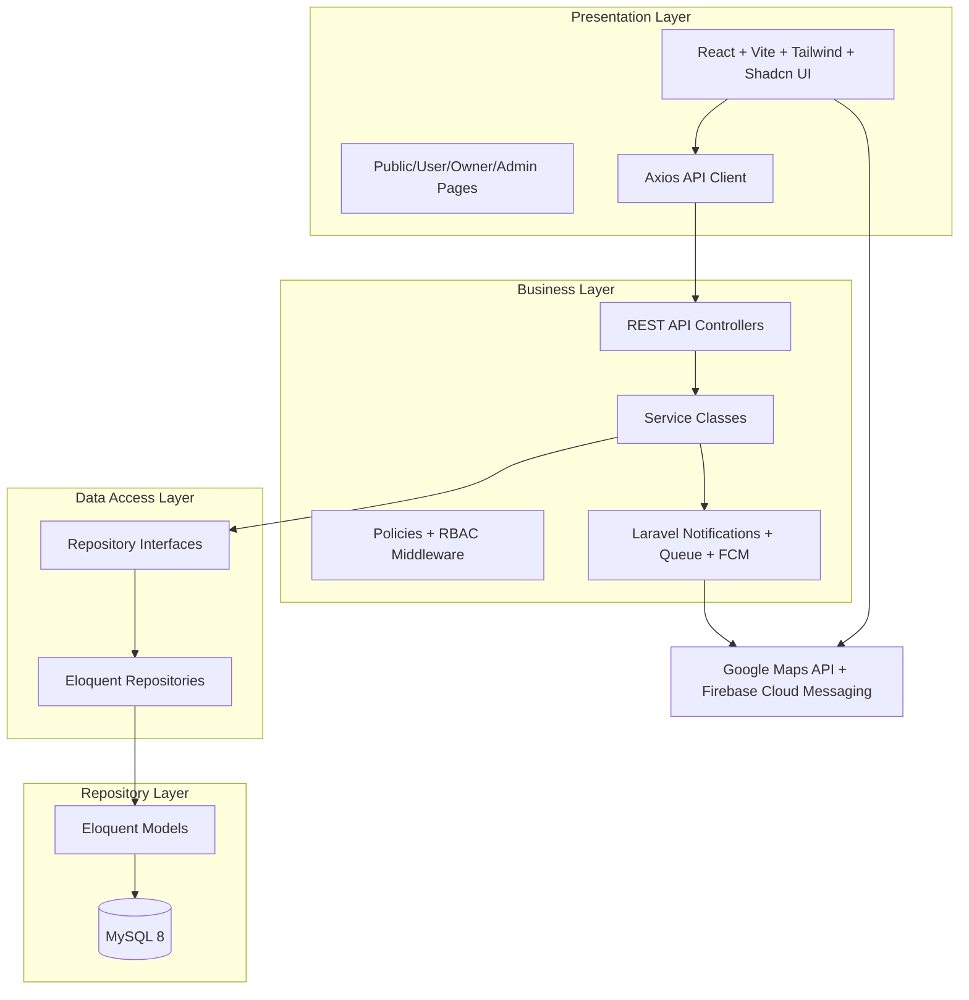

# Sistem Manajemen Wisata Kuliner Palembang (SMWKP)

SMWKP adalah rancangan dan scaffold aplikasi web production-ready untuk Dinas Pariwisata Kota Palembang. Sistem menggunakan arsitektur 4 layer: Presentation Layer (React), Business Layer (Laravel Services), Data Access Layer (Repositories), dan Repository Layer (Eloquent/MySQL).

## Project Architecture



## Folder Structure

```text
app/
  Contracts/Repositories/      # Repository interfaces
  Http/Controllers/Api/        # REST controllers per module
  Http/Middleware/             # RBAC/status middleware
  Models/                      # Eloquent models
  Notifications/               # Notification classes
  Policies/                    # Authorization policies
  Repositories/Eloquent/       # Repository implementations
  Services/                    # Business services
bootstrap/app.php              # Laravel 12 middleware aliases
config/smwkp.php               # Domain status constants
database/migrations/           # Ordered schema migrations
database/seeders/              # Realistic Palembang seed data
docs/                          # ERD, schema, deployment, API docs
routes/api.php                 # REST API endpoints
src/                           # React presentation layer
  components/                  # UI, maps, dashboards, state components
  lib/                         # axios, maps, firebase helpers
  pages/                       # Public, User, Owner, Admin pages
  routes/                      # React Router config
.github/workflows/ci.yml       # CI checks
```

## Quick Start

Backend target stack: Laravel 12, PHP 8.3, Sanctum, Spatie Permission, MySQL 8, queues. Frontend target stack: React, Vite, Tailwind CSS, React Router DOM, Axios.

```bash
composer install
npm install
cp .env.example .env
php artisan key:generate
php artisan migrate --seed
php artisan queue:work
npm run dev
```

## Output Map

1. Project Architecture: this README and `docs/ARCHITECTURE.md`
2. Folder Structure: this README
3. ERD: `docs/ERD.md`
4. Database Schema: `docs/DATABASE_SCHEMA.md`
5. Migration: `database/migrations/*`
6. Seeder: `database/seeders/*`
7. Model: `app/Models/*`
8. Repository: `app/Contracts/Repositories/*`, `app/Repositories/Eloquent/*`
9. Service: `app/Services/*`
10. Controller: `app/Http/Controllers/Api/*`
11. API Route: `routes/api.php`
12. Middleware: `app/Http/Middleware/*`, `bootstrap/app.php`
13. Policy: `app/Policies/*`
14. React Pages: `src/pages/*`
15. React Components: `src/components/*`
16. Dashboard: `src/components/dashboard/*`, `Admin/DashboardPage.jsx`, `Owner/DashboardPage.jsx`
17. Google Maps Integration: `src/components/maps/GoogleMapPanel.jsx`, `src/lib/maps.js`
18. Firebase Integration: `src/lib/firebase.js`, `app/Notifications/*`
19. Testing: `tests/Feature/*`, `tests/Unit/*`, `tests/Integration/*`
20. Deployment Guide: `docs/DEPLOYMENT.md`
