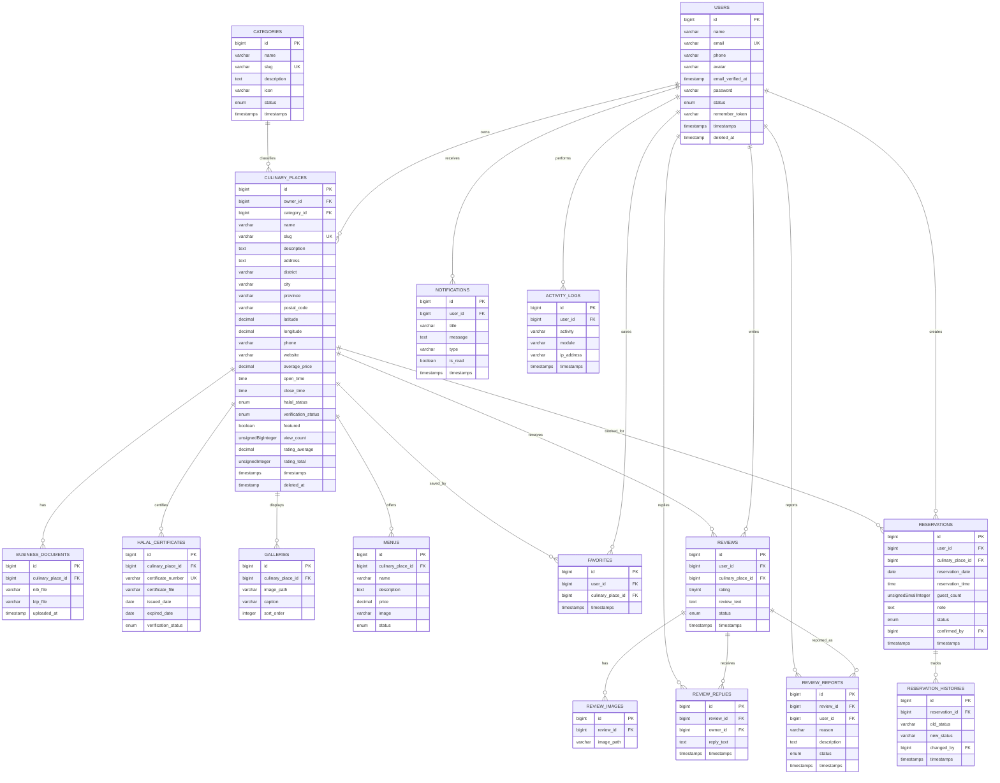

# ERD SMWKP

## Mermaid ER Diagram



## SQL Relationship Diagram

```sql
users.id -> culinary_places.owner_id
categories.id -> culinary_places.category_id
culinary_places.id -> business_documents.culinary_place_id
culinary_places.id -> halal_certificates.culinary_place_id
culinary_places.id -> galleries.culinary_place_id
culinary_places.id -> menus.culinary_place_id
users.id -> favorites.user_id
culinary_places.id -> favorites.culinary_place_id
users.id -> reviews.user_id
culinary_places.id -> reviews.culinary_place_id
reviews.id -> review_images.review_id
reviews.id -> review_replies.review_id
users.id -> review_replies.owner_id
reviews.id -> review_reports.review_id
users.id -> review_reports.user_id
users.id -> reservations.user_id
culinary_places.id -> reservations.culinary_place_id
users.id -> reservations.confirmed_by
reservations.id -> reservation_histories.reservation_id
users.id -> reservation_histories.changed_by
users.id -> notifications.user_id
users.id -> activity_logs.user_id
```

## Penjelasan Relasi

User pemilik usaha memiliki banyak `culinary_places`. Category mengelompokkan banyak kuliner. Wisatawan menyimpan kuliner melalui tabel pivot `favorites`, memberi `reviews`, dan membuat `reservations`. Review dapat memiliki foto, balasan owner, serta laporan. Reservasi memiliki histori status untuk audit. Notifikasi dan activity log terikat ke user untuk kebutuhan tracking dan push notification.
